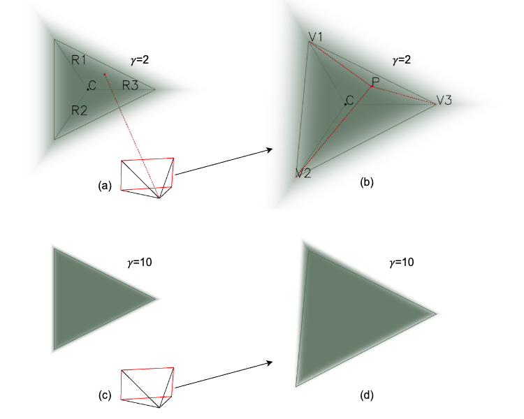

# 2D Triangle Splatting for Direct Differentiable Mesh Training
Kaifeng Sheng*, Zheng Zhou*, Yingliang Peng, Qianwei Wang (*Equal Contribution)

## - Project Overview

Official implementation of [2DTS][1] (2D Triangle Splatting for Direct Differentiable Mesh Training)

We provide a complete training pipeline for 2DTS, a differentiable 3D Geometric Representation adapted from [3DGS][2] (3D Gaussian Splatting) that replace the primitives from Gaussians to triangles, while retaining the full differentiability of the model.
The proposed method is capable of producing triangle meshes with high visual fidelity through an end-to-end training pipeline.


Our method can be applied to large-scale datasets, such as MatrixCity, which contains 6000+ images. Such datasets are challenging for existing mesh reconstruction methods, but our method can handle them efficiently.
The reconstructed meshes can be directly used in modern game engines, such as Blender, for relighting, shadow rendering, and other advanced rendering effects. See the following image for an example of relighting effect on a reconstructed mesh from MatrixCity dataset:


## - Abstract

Differentiable rendering with 3D Gaussian primitives has emerged as a powerful method for reconstructing high-fidelity 3D scenes from multi-view images.
While it offers improvements over NeRF-based methods, this representation still encounters challenges with rendering speed and advanced rendering effects, such as relighting and shadow rendering, compared to mesh-based models.
In this paper, we propose 2D Triangle Splatting (2DTS), a novel method that replaces 3D Gaussian primitives with 2D triangle facelets.
This representation naturally forms a discrete mesh-like structure while retaining the benefits of continuous volumetric modeling.
By incorporating a compactness parameter into the triangle primitives, we enable direct training of photorealistic meshes.
Our experimental results demonstrate that our triangle-based method, in its vanilla version (without compactness tuning), achieves higher fidelity compared to state-of-the-art Gaussian-based methods.
Furthermore, our approach produces reconstructed meshes with superior visual quality compared to existing mesh reconstruction methods.

## - Installation

1. Install CUDA 12.4 or higher (remember to set the environment variable `CUDA_HOME` to the CUDA installation path);
2. Clone the repository: `git clone https://github.com/GaodeRender/diff_recon.git; cd diff_recon`;
3. Create new conda environment with Python 3.12: `conda create -n 2dts python=3.12`;
   Activate the environment: `conda activate 2dts`;
4. Install dependencies: `pip install -r requirements.txt --no-cache-dir`;
5. Execute `pip install . --no-cache-dir` in the project root directory;


## - Usage
### Training
Execute `run_experiments.py` to train 2DTS models on one of Mip-NeRF 360, NerfSynthetic, Tanks and Temples, DeepBlending or MatrixCity datasets by running the following command: 
```bash
python run_experiments.py --type {experiment_type} --dataset_path /path/to/dataset --num_workers 0
```
`experiment_type` can be one of `MipNerf360`, `NerfSynthetic`, `NerfSynthetic_mesh`, `TanksAndBlending` or `MatrixCity_mesh`.

The script requires the dataset to be downloaded beforehand, and the dataset path should point to the root directory of the dataset.
For example, if you want to train a mesh model on the NerfSynthetic dataset, and have the dataset stored in `./data/nerf_synthetic`, you can run the following command:
```bash
python run_experiments.py --type NerfSynthetic_mesh --dataset_path ./data/nerf_synthetic --num_workers 0
```

### Logs
Training logs will be saved in the `./outputs` directory. You can use TensorBoard to visualize the training process:
```bash
tensorboard --logdir ./outputs
```

### Rendering
We provide an interactive web viewer based on [Viser Viewer][3] for visualizing the trained triangle splats and meshes.
You can run the viewer by executing the following command:
```bash
python viser_viewer.py --config /path/to/config --dataset_path /path/to/dataset --scene {scene_name}
```
For example, if you ran the `NerfSynthetic_mesh` experiment and want to visualize the `ship` scene, and have the dataset stored in `./data/nerf_synthetic`, you can run the following command:
```bash
python viser_viewer.py --config config/NerfSynthetic_VanillaTS_mesh.yaml --dataset_path ./data/nerf_synthetic --scene ship
```

Then, open your web browser and navigate to `http://localhost:8080` to view the rendered scene. If you are runing the viewer on a remote server, make sure to set up port forwarding or access the server's IP address directly.

## - Notes
We provided two distinct training configurations: VanillaTS and VanillaTS_mesh.
- VanillaTS is a close mimick of the original 3DGS method, with compactness parameter set to 1.0 and generating transparent and diffuse triangle splats (See [2DTS][1] for details).
- VanillaTS_mesh will add opacity regularization and compactness tuning to the training process, which will produce a solid triangle mesh at the end of training. The triangle mesh is saved as a `.glb` file in output directory. Note that when **back_culling** is **disabled** for the training process, **the mesh file will contain each triangle <span style="color:red">twice</span>**, once for the front face and once for the back face.

The difference between a diffuse and a solid triangle is visualized in the following image:

 

## - TODO

1. Our method assumes a dense point cloud initialization. The densification process like the one used in [3DGS][2] is turned off by default because of stability issues. New densification and initialization methods are being explored. Any contributions in this area are welcome.
2. The current implementation use a single set of opacity and color/sh parameters for each triangle splat. However, it is natural to extend the model to support per-vertex color and opacity, which will enhance the expressiveness of the model. We are working on this extension.

## - License

This repository contains code under **two different licenses**:

- 🟥 **Gaussian Splatting Research License** — applies to components derived from the original [Gaussian Splatting][2] project:
  - `submodules/custom-gaussian-rasterization/`
  - `submodules/simple-knn/`
  - These components are licensed for **non-commercial research use only**.
  - See [LICENSE.gausplat.md](./LICENSE.gausplat.md)

- 🟩 **MIT License** — applies to other parts of the repository, including:
  - `src/diff_recon/`
  - `submodules/diff-triangle-rasterization-2D/`, `submodules/diff-triangle-rasterization-3D/`, etc.
  - See [LICENSE](./LICENSE)

Please make sure to comply with both licenses when using this repository.

## - Citation

If you find our work useful, please consider citing our paper:
```bibtex
@misc{sheng20252dtrianglesplattingdirect,
      title={2D Triangle Splatting for Direct Differentiable Mesh Training}, 
      author={Kaifeng Sheng and Zheng Zhou and Yingliang Peng and Qianwei Wang},
      year={2025},
      eprint={2506.18575},
      archivePrefix={arXiv},
      primaryClass={cs.CV},
      url={https://arxiv.org/abs/2506.18575}, 
}
```

<!-- Reference -->
[1]: https://arxiv.org/abs/2506.18575
[2]: https://repo-sam.inria.fr/fungraph/3d-gaussian-splatting/
[3]: https://github.com/nerfstudio-project/viser